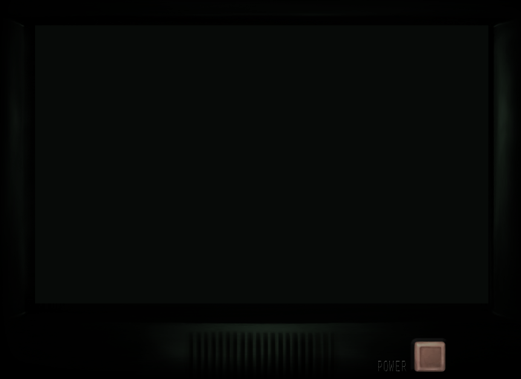
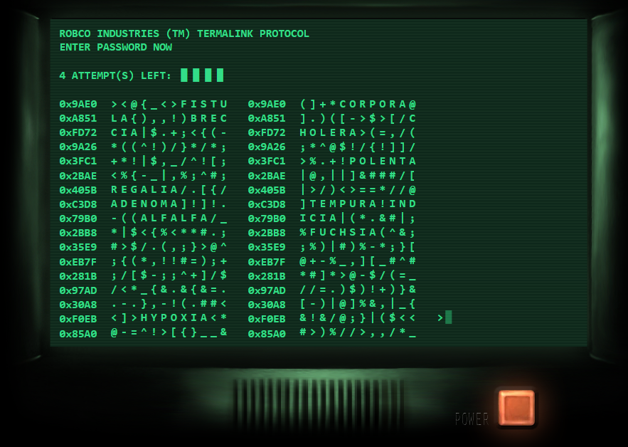

# Fallout Terminal

A recreation of the in-game computer terminals from the Fallout series. Text based hacking mini game simulated with a retro futuristic 
green monochrome interface built with react. [Live Link](https://falloutterminalapp.netlify.app/)
## Preview

## Challenges
- Implementing simulated typewriter effect for any words that were hovered was a difficult part since adding the asynchronous aspect wasn't working as intended. To fix this, I instead added an equal sign so that it will equal to the word after typing, automatically making the word whole
- On this project, I wanted to try and make elements responsive without media queries. CSS properties such as max width and viewport heights had a bigger impact on responsiveness than I anticipated.
- Getting the terminal dud codes to match opening with closing tags was a challenge since the amount of characters in a dud code could be cut off by other random characters. To counteract it, looping through the character number to account for how much is inside is necessary to prevent false duds from being recognized and taken as authentic. 

